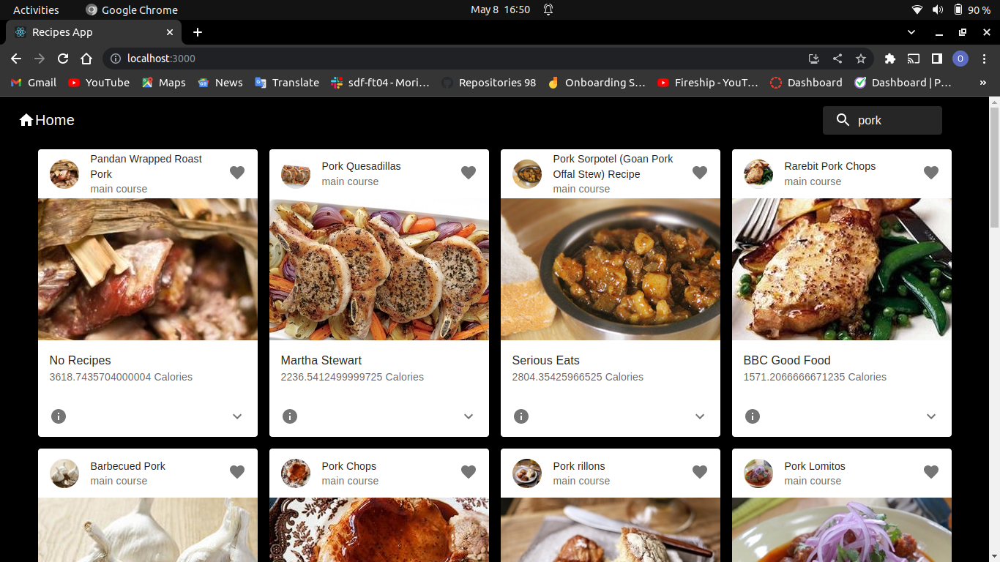

# Recipes #
The purpose of Recipes is to make cooking enjoyable and stress-free. We provide recipes created by culinary professionals for those who cook at home. We understand that cooking is crucial to living a healthier and more enjoyable life for individuals, communities, and the earth, hence our purpose is to make cooking pleasurable. By exchanging recipes and cooking advice, we encourage home cooks throughout the globe to assist one another.

## Demo Video ##

# To view the published HTML as a website #
To visit this website, click on the link [here](https://mapishi.netlify.app/)

## Author ##
Ngare Maina 

## License ##
GNU GENERAL PUBLIC LICENSE